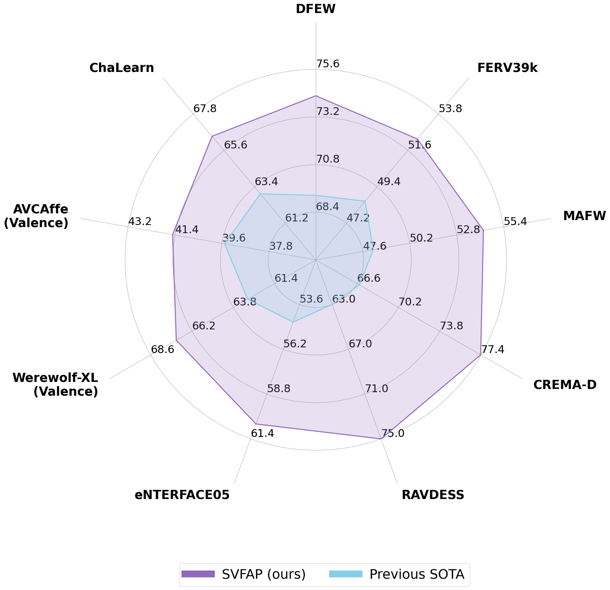

# [SVFAP: Self-supervised Video Facial Affect Perceiver](https://ieeexplore.ieee.org/abstract/document/10623380)

[](https://paperswithcode.com/sota/dynamic-facial-expression-recognition-on-dfew?p=svfap-self-supervised-video-facial-affect)
[](https://paperswithcode.com/sota/dynamic-facial-expression-recognition-on?p=svfap-self-supervised-video-facial-affect)
[](https://paperswithcode.com/sota/dynamic-facial-expression-recognition-on-mafw?p=svfap-self-supervised-video-facial-affect)

> [[arXiv]](https://arxiv.org/abs/2401.00416), [[IEEE Xplore]](https://ieeexplore.ieee.org/abstract/document/10623380) <br>
> [Licai Sun](https://scholar.google.com/citations?user=7qo_cTcAAAAJ&hl=en&oi=ao), [Zheng Lian](https://scholar.google.com/citations?user=S34nWz0AAAAJ&hl=en), Kexin Wang, Yu He, Mingyu Xu, Haiyang Sun, [Bin Liu](https://scholar.google.com/citations?user=UEB_5QEAAAAJ&hl=en), and [Jianhua Tao](https://scholar.google.com/citations?user=781jbHMAAAAJ&hl=en)<br>
> University of Chinese Academy of Sciences & Institute of Automation, Chinese Academy of Sciences & Tsinghua University<br>

## 📰 News
**[2024.09.24]** We upload the code, pre-trained and fine-tuned models.<br>
**[2024.07.28]** Our paper is accepted by IEEE Transactions on Affective Computing.<br>

## ✨ Overview


<p align="center">
   <br>
  Overview of SVFAP.
</p>


<p align="center">
   <br>
  Encoder architecture (i.e., TPSBT) in SVFAP.
</p>

Abstract: Video-based facial affect analysis has recently attracted increasing attention owing to its critical role in human-computer interaction. Previous studies mainly focus on developing various deep learning architectures and training them in a fully supervised manner. Although significant progress has been achieved by these supervised methods, the longstanding lack of large-scale high-quality labeled data severely hinders their further improvements. Motivated by the recent success of self-supervised learning in computer vision, this paper introduces a self-supervised approach, termed Self-supervised Video Facial Affect Perceiver (SVFAP), to address the dilemma faced by supervised methods. Specifically, SVFAP leverages masked facial video autoencoding to perform self-supervised pre-training on massive unlabeled facial videos. Considering that large spatiotemporal redundancy exists in facial videos, we propose a novel temporal pyramid and spatial bottleneck Transformer as the encoder of SVFAP, which not only largely reduces computational costs but also achieves excellent performance. To verify the effectiveness of our method, we conduct experiments on nine datasets spanning three downstream tasks, including dynamic facial expression recognition, dimensional emotion recognition, and personality recognition. Comprehensive results demonstrate that SVFAP can learn powerful affect-related representations via large-scale self-supervised pre-training and it significantly outperforms previous state-of-the-art methods on all datasets.

## 🚀 Main Results

<p align="center">
   <br>
   Comparison with state-of-the-art methods on 9 datasets.
</p>

Please check our paper to see detailed results on each dataset.


## 🔨 Installation

Main prerequisites:

* `Python 3.8`
* `PyTorch 1.7.1 (cuda 10.2)`
* `timm==0.4.12`
* `einops==0.6.1`
* `decord==0.6.0`
* `scikit-learn=1.1.3`
* `scipy=1.10.1`
* `pandas==1.5.3`
* `numpy=1.23.4`
* `opencv-python=4.7.0.72`
* `tensorboardX=2.6.1`

If some are missing, please refer to [environment.yml](environment.yml) for more details.


## ➡️ Data Preparation

Please follow the files (e.g., [dfew.py](preprocess/dfew.py)) in [preprocess](preprocess) for data preparation.

Specifically, you need to generate annotations for dataloader ("<path_to_video> <video_class>" in annotations). 
The annotation usually includes `train.csv`, `val.csv` and `test.csv`. The format of `*.csv` file is like:

```
dataset_root/video_1  label_1
dataset_root/video_2  label_2
dataset_root/video_3  label_3
...
dataset_root/video_N  label_N
```

An example of [train.csv](saved/data/dfew/org/split01/train.csv) of DFEW fold1 (fd1) is shown as follows:

```
/data/ycs/AC/Dataset/DFEW/Clip/jpg_256/02522 5
/data/ycs/AC/Dataset/DFEW/Clip/jpg_256/02536 5
/data/ycs/AC/Dataset/DFEW/Clip/jpg_256/02578 6
```

Note that, `label` for the pre-training dataset (i.e., VoxCeleb2) is dummy label, you can simply use `0` (see [voxceleb2.py](preprocess/voxceleb2.py)).


## 🔄 Pre-training SVFAP

- VoxCeleb2

    ```
    sh scripts/voxceleb2/pretrain_svfap_base.sh
    ```
    
    You can download our pre-trained model on VoxCeleb2 from [here](https://unioulu-my.sharepoint.com/:u:/g/personal/lsun24_univ_yo_oulu_fi/EUhhmb_5-ltMt7P7pjm3D1IBkdREeGnOrAW4kGrfEZSFxA?e=Iqarze) and put it into [this folder](saved/model/pretraining/voxceleb2/svfap_pretrain_base_patch16_160_frame_16x4_tube_mask_ratio_0.9_e100).

## ⤴️ Fine-tuning with pre-trained models

- DFEW

    ```
    sh scripts/dfew/finetune_svfap_base.sh
    ```

    The fine-tuned checkpoints and logs across five folds on DFEW are provided as follows: 
    |  Fold    | UAR        | WR       |      Fine-tuned   Model            |
    | :------: | :--------: | :------: | :-----------------------:          |
    |  1       | 63.63      | 75.31    | [log](https://unioulu-my.sharepoint.com/:u:/g/personal/lsun24_univ_yo_oulu_fi/ETyu-mn8WyVCti6ifvs7ePMBBm0rV4HyEKNrJVIory3VPA?e=pGEYRA) / [checkpoint](https://unioulu-my.sharepoint.com/:u:/g/personal/lsun24_univ_yo_oulu_fi/EXEnKAHX2ZxPrWvUAJ9Glg0B6GuYbw8ox9Zs3jn7lJ7jJA?e=ffXMQK) | 
    |  2       | 58.82      | 71.68    | [log](https://unioulu-my.sharepoint.com/:u:/g/personal/lsun24_univ_yo_oulu_fi/ESGtilAWM8lJm9TUpTVOcysB11kZjUyFHfqArfyLDDcfcw?e=xDpxUb) / [checkpoint](https://unioulu-my.sharepoint.com/:u:/g/personal/lsun24_univ_yo_oulu_fi/EfkLBkkmGqpPigAzL_S_FFABfuOShaNkrlcsSJLFrw2nHw?e=mKagKP) | 
    |  3       | 64.88      | 74.96    | [log](https://unioulu-my.sharepoint.com/:u:/g/personal/lsun24_univ_yo_oulu_fi/EXRgNapDf1tOv9y1ddW1AkQBOeQNvDk-4YAcf9Gq9VPJ1g?e=bNfvaG) / [checkpoint](https://unioulu-my.sharepoint.com/:u:/g/personal/lsun24_univ_yo_oulu_fi/ESbBQRwY--9Iuah3lUuuglkBwwkevZF4ftGKEDMO-HhxUA?e=3C2rkm) | 
    |  4       | 63.73      | 74.65    | [log](https://unioulu-my.sharepoint.com/:u:/g/personal/lsun24_univ_yo_oulu_fi/ES9drCuXPyBFj8ogdGI_vbgB9wKuk2TAechC2m0p4P0Fkg?e=30yufp) / [checkpoint](https://unioulu-my.sharepoint.com/:u:/g/personal/lsun24_univ_yo_oulu_fi/EaOR9NCzaYVNuqop89cNI94BlqrzeiRmXP-amDL2tTCw5g?e=obLurU) | 
    |  5       | 68.39      | 77.44    | [log](https://unioulu-my.sharepoint.com/:u:/g/personal/lsun24_univ_yo_oulu_fi/EWPC0RKo9g9AkdMAzByllkcBY7vPha1jGKw_AHYHrDztsQ?e=fLxkpe) / [checkpoint](https://unioulu-my.sharepoint.com/:u:/g/personal/lsun24_univ_yo_oulu_fi/EUDW_x4ly-hNlUs-PhSqKMMBRnP1ku16eu--dS9KrgeT6Q?e=I4VlyF) |
    |  Total (Reproduced)   | 63.89      | 74.81    | - |
    |  Total (Reported)     | 62.83      | 74.27    | - |

    Note that we lost the original ckpt for this dataset. However, the reproduced result is better than that reported in the paper.

- FERV39k

    ```
    sh scripts/ferv39k/finetune_svfap_base.sh
    ```
      
    The fine-tuned checkpoints and logs on FERV39k are provided as follows:
    |  Version    | UAR        | WR       |      Fine-tuned   Model            |
    | :------:    | :--------: | :------: | :-----------------------:          |
    |  Reproduced | 43.05      | 52.86    | [log](https://unioulu-my.sharepoint.com/:u:/g/personal/lsun24_univ_yo_oulu_fi/EYTAPbF2rt1Oo0ESuXWmTaYByZpTeNGWvAv9UjO4k1oomA?e=ClHfxJ) / [checkpoint](https://unioulu-my.sharepoint.com/:u:/g/personal/lsun24_univ_yo_oulu_fi/EeiFyC-HLaBAntblXgeOt5sBB5KJJttxbQn7iMlotUvX2A?e=OqqIST) |
    |  Reported   | 42.14      | 52.29    | -        | 
  
    Note that we lost the original ckpt for this dataset. However, the reproduced result is better than that reported in the paper.
- MAFW

    ```
    sh scripts/mafw/finetune_svfap_base.sh
    ```
    
    The fine-tuned checkpoints and logs across five folds on MAFW are provided as follows: 
    |  Fold    | UAR        | WR       |      Fine-tuned   Model            |
    | :------: | :--------: | :------: | :-----------------------:          |
    |  1       | 38.40      | 49.10    | [log](https://unioulu-my.sharepoint.com/:u:/g/personal/lsun24_univ_yo_oulu_fi/Eb_Yv4I6cQxLu5xd92rDqTYBCSPMQ9uMQTrOcunXfGpx9Q?e=tpvm53) / [checkpoint](https://unioulu-my.sharepoint.com/:u:/g/personal/lsun24_univ_yo_oulu_fi/EYdknPrtbo1Mt1NYjUqJtsIBVzBCPIU-HPPwhCcuvUg1hA?e=bKnU4U) | 
    |  2       | 40.94      | 53.95    | [log](https://unioulu-my.sharepoint.com/:u:/g/personal/lsun24_univ_yo_oulu_fi/EVwFn7PV-LJNiXcTEZZVtOoBvlxu8RvTj3sSN9RZQPGCwg?e=4JaHG5) / [checkpoint](https://unioulu-my.sharepoint.com/:u:/g/personal/lsun24_univ_yo_oulu_fi/EUWnPxO1gbNInVOeFaUPL8EBzfPvfWKaxidusQv8_J6h2Q?e=853E0o) | 
    |  3       | 46.27      | 59.68    | [log](https://unioulu-my.sharepoint.com/:u:/g/personal/lsun24_univ_yo_oulu_fi/EZHAxnIfRPxIkE-HURMdITwBkS3SUSlt52d-dyaiDtKQWQ?e=Xhacur) / [checkpoint](https://unioulu-my.sharepoint.com/:u:/g/personal/lsun24_univ_yo_oulu_fi/Eftx7YovMn9Mqn6FwfsQFdoBCFBxDu4fSWnw9307Xs_OBA?e=F0r91e) | 
    |  4       | 47.78      | 61.30    | [log](https://unioulu-my.sharepoint.com/:u:/g/personal/lsun24_univ_yo_oulu_fi/EXGKZ00eHgdJtimGsDB7-pkBZmJs_q2QEQG2l3P042XuLg?e=vN2G3E) / [checkpoint](https://unioulu-my.sharepoint.com/:u:/g/personal/lsun24_univ_yo_oulu_fi/EaBj2GjlldBKt8kwxeve01QBOISd2PuvR16CLT2GOVZ7Ww?e=aofdJD) | 
    |  5       | 44.17      | 57.56    | [log](https://unioulu-my.sharepoint.com/:u:/g/personal/lsun24_univ_yo_oulu_fi/EXFC7KBKtz5JrDvOnc450TEB0R-Ey3UegqpaqpkSy1uK0A?e=ywMSWY) / [checkpoint](https://unioulu-my.sharepoint.com/:u:/g/personal/lsun24_univ_yo_oulu_fi/ET1EUbbzVABKlko3ibr2zNoBq1_h7UvQ_WP4-jhtH1M-SQ?e=vLzP80) |
    |  Total (Reproduced)   | 43.51      | 56.31    | - |
    |  Total (Reported)     | 41.19      | 54.28    | - |

    Note that we lost the original ckpts for this dataset. However, the reproduced result is better than that reported in the paper.

## ☎️ Contact 

If you have any questions, please feel free to reach me out at `Licai.Sun@oulu.fi`.

## 👍 Acknowledgements

This project is built upon [VideoMAE](https://github.com/MCG-NJU/VideoMAE). Thanks for their great codebase.

## ✏️ Citation

If you think this project is helpful, please feel free to leave a star⭐️ and cite our paper:

```
@article{sun2024svfap,
  title={SVFAP: Self-supervised video facial affect perceiver},
  author={Sun, Licai and Lian, Zheng and Wang, Kexin and He, Yu and Xu, Mingyu and Sun, Haiyang and Liu, Bin and Tao, Jianhua},
  journal={IEEE Transactions on Affective Computing},
  year={2024},
  publisher={IEEE}
}
```


